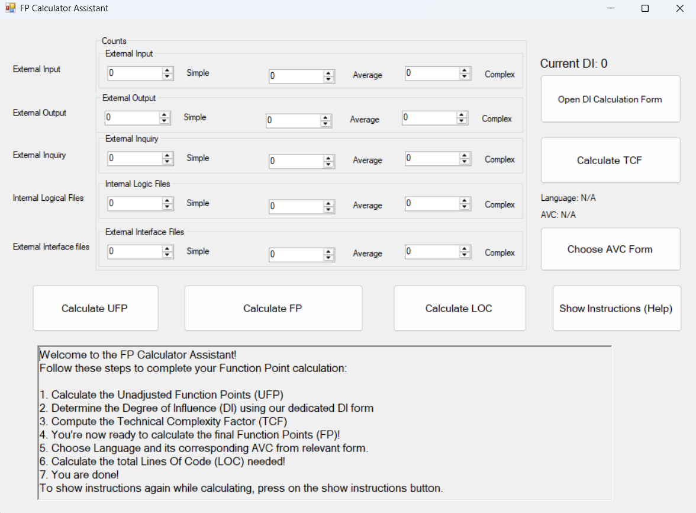

# FP Calculator Assistant

Welcome to the **FP Calculator Assistant**, a user-friendly tool designed for academic purposes to help you calculate **Function Points (FP)** — a widely used metric in software engineering for estimating the size and effort of software projects.

This project was developed as part of a **Software Metrics** academic course and provides a structured, step-by-step interface to guide users through all stages of the FP calculation process.

---

## 📋 Features

- ✅ Guided calculation of **Unadjusted Function Points (UFP)**
- ✅ Easy input form for **Degree of Influence (DI)**
- ✅ Automatic computation of **Technical Complexity Factor (TCF)**
- ✅ Final FP calculation with simple instructions
- ✅ Selection of **Programming Language** with corresponding **Average Value per Code line (AVC)**
- ✅ Automatic calculation of **Lines of Code (LOC)**
- ✅ Re-displayable instructions at any time using a dedicated button

---

## 🚀 How It Works

Follow these steps to complete your Function Point analysis using the tool:

1. **Calculate the Unadjusted Function Points (UFP)**  
   Enter the count of inputs, outputs, user queries, files, and external interfaces.

2. **Determine the Degree of Influence (DI)**  
   Fill out the DI form to assess the complexity of various aspects of the system.

3. **Compute the Technical Complexity Factor (TCF)**  
   Based on your DI inputs, the system computes the TCF automatically.

4. **Calculate the final Function Points (FP)**  
   The FP is calculated using the UFP and TCF values.

5. **Choose a Programming Language and its AVC**  
   Select a language from the list and its Average Value per Code line (AVC) will be used.

6. **Compute Lines Of Code (LOC)**  
   The system calculates the total estimated LOC using FP × AVC.

7. **You're Done!** 🎉

---

## 🧭 Need Help?

Click the **"Show Instructions"** button at any time during the process to view these steps again.

---

## 📚 Technologies Used

- **Language:** C#
- **Framework:** Windows Forms (.NET)

---

## 🛠️ How to Run

> 💡 This is a C# Windows Forms Application. Make sure you have the **.NET Desktop Development** workload installed.

### Recommended Option: Using Visual Studio

1. **Clone the Repository**

   ```bash
   git clone https://github.com/linzi-v7/metrics-proj.git
    ````

2. **Open the Solution**

   - Launch **Visual Studio**.
   - Open the `.sln` file from the cloned directory.

3. **Build and Run**

   - Press `F5` or click `Start` to build and run the application.

---

## Screenshots

- **User Interface** – The program's initial display.  
    

---

## 🎓 Academic Info

This project was developed as part of the **Software Metrics** course in Ain Shams University.

---

## 📄 License

This project is licensed under the **MIT License**, meaning you are free to use, modify, and distribute it with attribution. Read the full terms [here](https://github.com/linzi-v7/metrics-proj/blob/main/LICENSE).  

---

## Contact  

Have feedback or want to collaborate? Feel free to connect:  

- **GitHub** – [linzi-v7](https://github.com/linzi-v7)  
- **LinkedIn** – [Faris Osama](https://www.linkedin.com/in/faris-osama-7a3496303/)  

---

### 📌 Project Status: **Completed** 🚀
